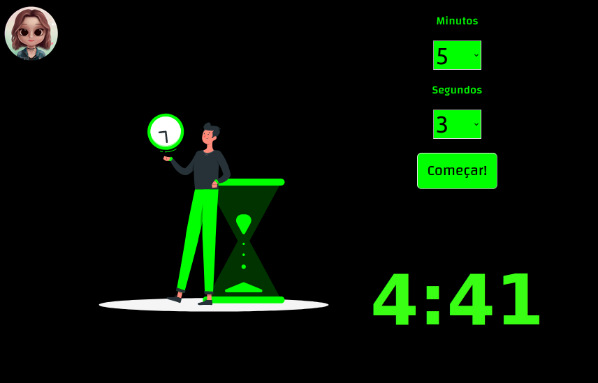

# Cronômetro Regressivo 
 um cronômetro regressivo e simples, quando o tempo esgota vocÇe recebe um alerta.

  **Experimente Agora:**[Cronômetro Regressivo](https://app.netlify.com/sites/cronometro-regressivo/deploys)
 

## Tecnologias usadas:
- HTML5
- CSS3
- JavaScript
- Visual Studio Code